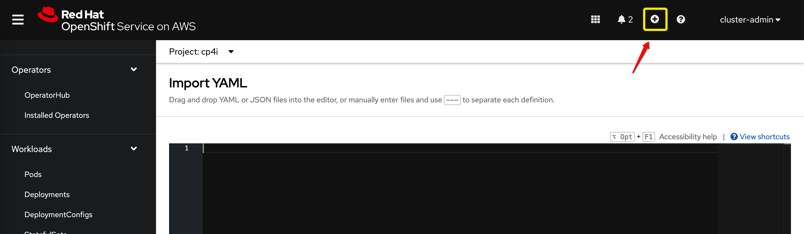

# Installation of IBM CP4I 2022.2.1 on AWS ROSA with EBS storage

## Introduction notes

We assume here that the following steps are already completed:
1. Catalog sources for IBM operators are added to the OpenShift cluster - please see [https://www.ibm.com/docs/en/cloud-paks/cp-integration/2022.2?topic=installing-adding-catalog-sources-your-openshift-cluster](https://www.ibm.com/docs/en/cloud-paks/cp-integration/2022.2?topic=installing-adding-catalog-sources-your-openshift-cluster)  
2. Operators for the IBM Cloud Pak for Integration and for the required capabilities installed- please see [https://www.ibm.com/docs/en/cloud-paks/cp-integration/2022.2?topic=installing-operators](https://www.ibm.com/docs/en/cloud-paks/cp-integration/2022.2?topic=installing-operators)

We also assume that there is an OpenShift project (namespace) with the name **cp4i** and that the IBM Entitlement Key secret is already created in that namespace. For the instructions on how to create that secret see the following chapter from the documentation: [https://www.ibm.com/docs/en/cloud-paks/cp-integration/2022.2?topic=installing-applying-your-entitlement-key-online-installation](https://www.ibm.com/docs/en/cloud-paks/cp-integration/2022.2?topic=installing-applying-your-entitlement-key-online-installation)

The following storage classes exist in ROSA out-of-the-box:
```
NAME            PROVISIONER             RECLAIMPOLICY   VOLUMEBINDINGMODE      ALLOWVOLUMEEXPANSION
gp2             kubernetes.io/aws-ebs   Delete          WaitForFirstConsumer   true                
gp2-csi         ebs.csi.aws.com         Delete          WaitForFirstConsumer   true                
gp3 (default)   ebs.csi.aws.com         Delete          WaitForFirstConsumer   true                
gp3-csi         ebs.csi.aws.com         Delete          WaitForFirstConsumer   true                
```

All of those classes are of the block, RWO type. For the instance of CP4I Platform UI (Platform Navigator), we need an RWX class. So to proceed with the existing classes as they are, we followed the alternative installation method described here: [https://www.ibm.com/docs/en/cloud-paks/cp-integration/2022.2?topic=ui-deploying-platform-rwo-storage](https://www.ibm.com/docs/en/cloud-paks/cp-integration/2022.2?topic=ui-deploying-platform-rwo-storage)

This approach means that we create a kind of RWX "facade" or "wrapper" around the existing RWO class. In our case, we decided to use the existing **gp3** class.

## Deploying Rook NFS

1. Clone branch v1.7.3 of the rook nfs git repository:
    ```
    git clone --single-branch --branch v1.7.3 https://github.com/rook/nfs.git
    ```

2. Navigate to this directory:
    ```
    cd nfs/cluster/examples/kubernetes/nfs
    ```

3. Edit file **operator.yaml** Replace the original image **rook/nfs:v1.7.3** with IBM provided one: **icr.io/cpopen/cpd/rook-nfs:kz-220512**

    An example of updated [operator.yaml](artefacts/operator.yaml) file is available here in this repository in the [artefacts](artefacts) directory.

4. Still in the directory **nfs/cluster/examples/kubernetes/nfs** , apply **crds.yaml** to create custom resource definitions:  
    ```
    oc apply -f crds.yaml
    ```

5. Create operator deployment:
    ```
    oc apply -f operator.yaml
    ```

6. Verify that operator is running:
    ```
    oc get pod -n rook-nfs-system
    ```

    The result should be similar to the following:
    ```
    NAME                                 READY   STATUS    RESTARTS   AGE
    rook-nfs-operator-84fff9f699-45v2c   1/1     Running   0          43s
    ```

7. Grant the Rook NFS service account access to the privileged SecurityContextConstraints (SCC) resources:
    ```
    oc adm policy add-scc-to-user privileged system:serviceaccount:rook-nfs:rook-nfs-server
    ```

## Deploying the Rook NFS server

Apply the following YAMLs by storing them to files and running the CLI command: `oc apply -f <file_name>` or by copy/pasting them to the *Import YAML* window in OpenShift web console:

  

1. Create RBAC objects:
    ```yaml
    ---
    apiVersion: v1
    kind: Namespace
    metadata:
      name:  rook-nfs
    ---
    apiVersion: v1
    kind: ServiceAccount
    metadata:
      name: rook-nfs-server
      namespace: rook-nfs
    ---
    kind: ClusterRole
    apiVersion: rbac.authorization.k8s.io/v1
    metadata:
      name: rook-nfs-provisioner-runner
    rules:
      - apiGroups: [""]
        resources: ["persistentvolumes"]
        verbs: ["get", "list", "watch", "create", "delete"]
      - apiGroups: [""]
        resources: ["persistentvolumeclaims"]
        verbs: ["get", "list", "watch", "update"]
      - apiGroups: ["storage.k8s.io"]
        resources: ["storageclasses"]
        verbs: ["get", "list", "watch"]
      - apiGroups: [""]
        resources: ["events"]
        verbs: ["create", "update", "patch"]
      - apiGroups: [""]
        resources: ["services", "endpoints"]
        verbs: ["get"]
      - apiGroups: ["policy"]
        resources: ["podsecuritypolicies"]
        resourceNames: ["rook-nfs-policy"]
        verbs: ["use"]
      - apiGroups: [""]
        resources: ["endpoints"]
        verbs: ["get", "list", "watch", "create", "update", "patch"]
      - apiGroups:
        - nfs.rook.io
        resources:
        - "*"
        verbs:
        - "*"
    ---
    kind: ClusterRoleBinding
    apiVersion: rbac.authorization.k8s.io/v1
    metadata:
      name: rook-nfs-provisioner-runner
    subjects:
      - kind: ServiceAccount
        name: rook-nfs-server
        namespace: rook-nfs
    roleRef:
      kind: ClusterRole
      name: rook-nfs-provisioner-runner
      apiGroup: rbac.authorization.k8s.io    
    ```

2. Create PersistenVolumeClaim for NFS. Please note that we selected here **gp3** as an existing RWO class that we are going to use. We also left the recomended size of 200 GB. This size actually depends on the planned number of instances of capabilities that require RWX storage. If we need it just for Platform UI then we can decide for the smaller size. By the documentation the required storage for Platform UI is 40 GB. <br>
**Note:** Please do not be surprised if this PVC remains in the **pending** state. The volume binding mode for those classes is *WaitForFirstConsumer*. So, the volume will be created when it is really needed (in the next step when we deploy the server).
    ```yaml
    apiVersion: v1
    kind: PersistentVolumeClaim
    metadata:
      name: nfs-pwx-claim
      namespace: rook-nfs
    spec:
      storageClassName: gp3  # we decided to use gp3, change if necessary 
      accessModes:
      - ReadWriteOnce
      resources:
        requests:
          storage: 200Gi    
    ```

3. Deploy the NFS server (note that the PVC created previously is now bound):
    ```yaml
    apiVersion: nfs.rook.io/v1alpha1
    kind: NFSServer
    metadata:
      name: rook-nfs
      namespace: rook-nfs
    spec:
      replicas: 1
      exports:
      - name: share1
        server:
          accessMode: ReadWrite
          squash: "none"
        # A Persistent Volume Claim must be created before creating NFS CRD instance.
        persistentVolumeClaim:
          claimName: nfs-pwx-claim
      # A key/value list of annotations
      annotations:
        rook: nfs    
    ```

4. Verify that server pod is running:
    ```
    oc get pods -n rook-nfs
    ```
    The result should be similar to the following:
    ```
    NAME         READY   STATUS    RESTARTS   AGE
    rook-nfs-0   2/2     Running   0          20m    
    ```


